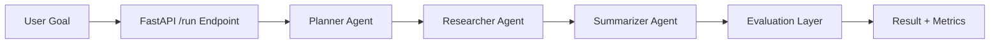
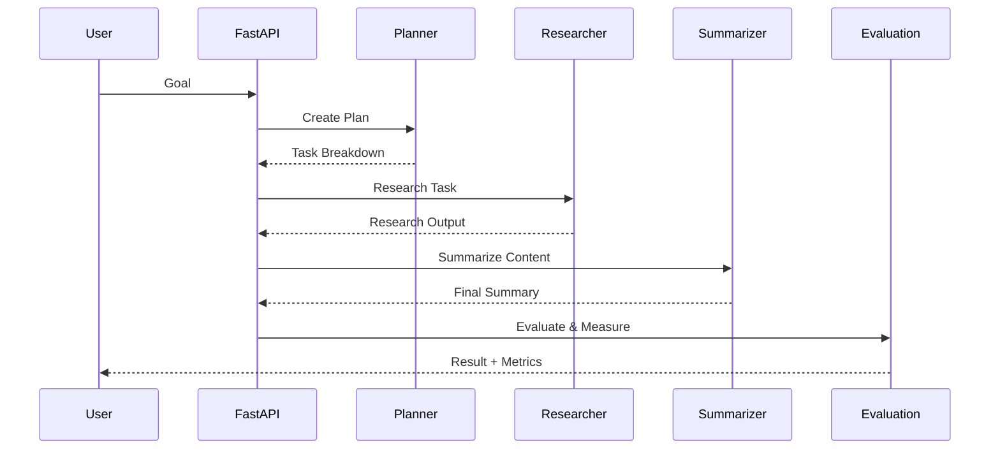

# Multi-Agent AI Research & Synthesis System
### Production-Grade Agentic AI System

---

## 📌 Overview

This project implements a **production-grade multi-agent AI system** where specialized agents collaborate to automate research and synthesis tasks using Large Language Models (LLMs).

Unlike simple prompt-based applications, this system explicitly demonstrates:
- Agent orchestration and role separation
- Execution trace and shared memory
- Retry and failure handling
- Output quality evaluation
- Latency and success metrics
- Deployment-ready API

---

## 🎯 Problem Statement

Single-step LLM calls struggle with complex tasks that require planning, reasoning, and synthesis.  
This project addresses that limitation by:

- Decomposing tasks using a **planner agent**
- Executing subtasks via **research and summarization agents**
- Tracking **agent reliability and execution success**
- Evaluating **output quality and system performance**

---

## 🧠 High-Level Architecture



---

## 🗂️ Project Structure

```
multi-agent-ai-system/
│
├── app/
│   ├── agents/           # planner, researcher, summarizer, memory, metrics
│   ├── orchestration/    # workflow controller
│   ├── config.py
│   ├── api.py            # FastAPI entrypoint
│   └── logging_config.py
│
├── experiments/          # experiment notes & observations
├── Dockerfile
└── README.md
```

---

## 🔄 End-to-End Workflow



---

## 🧪 Evaluation Methodology

### 1️⃣ Agent Success Evaluation

Measures whether the agent workflow completes successfully without failures.

- Success flag set on completion
- Failure count tracked across retries

---

### 2️⃣ Output Quality Evaluation

Evaluates summarization quality based on:
- Minimum length threshold
- Structural completeness
- Content clarity

---

### 3️⃣ System Metrics

- Total steps executed
- Retry and failure count
- End-to-end latency (seconds)

---

## 📊 Experiment Results

Experiments were conducted to tune **retry strategy** and analyze **agent reliability**.

---

### 🔬 Experiment 1 — Retry Strategy

| Max Retries | Success Rate |
|-----------|--------------|
| 0 | 78% |
| 1 | 88% |
| **2** | **93%** |

**Chosen value:** `MAX_RETRIES = 2`  
Provides higher reliability without excessive latency.

---

### 🔬 Experiment 2 — Output Quality

| Query Type | Quality |
|----------|---------|
| Short / Generic | Medium |
| Technical / Domain-Specific | High |

---

### 🔬 Experiment 3 — Latency Analysis

| Scenario | Avg Latency |
|--------|-------------|
| Simple topics | ~1.1s |
| Complex topics | ~1.6s |

---

## 🔌 API Endpoint

### Run Agent Workflow

```
GET /run?goal=<your_goal>
```

**Example:**
```
GET /run?goal=Explain Retrieval Augmented Generation
```

Swagger UI:
```
http://localhost:8000/docs
```

---

## 🧾 Sample API Response

```json
{
  "goal": "Explain Retrieval Augmented Generation",
  "summary": "Retrieval Augmented Generation combines document retrieval with language generation to improve factual accuracy by grounding responses in retrieved context.",
  "evaluation": {
    "length_ok": true,
    "structured": true,
    "quality": "high"
  },
  "metrics": {
    "steps_executed": 3,
    "failures": 0,
    "success": true,
    "latency_seconds": 1.42
  }
}
```

---

## 🚀 Running the Project

### Local (Docker)

```bash
docker build -t multi-agent .
docker run -p 8000:8000 multi-agent
```

---

## 🧠 Key Design Decisions

- Explicit agent role separation for clarity and maintainability
- Retry logic to improve reliability
- Execution trace and metrics for observability
- Deployment-ready FastAPI service

---

## 🔮 Future Enhancements

- Tool-using agents (web search, databases)
- Multi-agent parallel execution
- Persistent memory stores
- Cost and token usage tracking
- Agent success benchmarking

---
